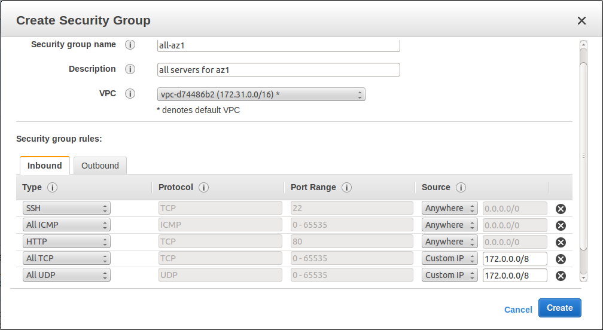

CMS on AWS
**********

Introduction
============

This article will explain how to fully configure CMS to 100% run on AWS. Some
highlights:

* Sticky sessions using ELB and nginx.
* cmsWorkerService will live on different machines.
* Amazon RDS for the database.
* Using pre-built `Docker images`_ (it is easy to build your own).
* Setup:
    * 1 "admin" machine: ``cmsInitDB`` and ``cmsAdminService``.
    * 1 powerful CWS machine: 32 * ``ContestWebService`` (container isolation).
    * N worker machines: ``cmsWorker``.
    * 1 machine for all the rest.

We will start from scratch.

Preparing the security group
============================

We will have a security group ``all-az1`` (and an equivalent ``all-az2``) which
will be used for everything: web server, RDS and internal services. Rules:

* Allow SSH and HTTP from everywhere.
* Allow all ICMP from everywhere.
* Allow all TCP and UDP from ``172.0.0.0/8``.

Running CWS on multiple availability zones is possible, but is out of scope of
this document.

Preparing the database
======================

We will use a hosted database solution: `Amazon RDS`_ (Relational Database
Service) to run our database. Benefits: convenience and safety (multi-AZ
deployment with automatic failover, backups, out-of-the-box monitoring).

Picking the right instance
--------------------------

Datababase size (RAM and CPU) boils down to a question "how many connections
will I have at any moment". Web server is the most intense user of the database
connections. For 1000 queries per second to ContestWebService, 1000 connections
is an optimistic estimate (~12 GB RAM required on postgresql), and 2000
connections should be adequate for a "bad day" (~24 GB RAM). We choose
``db.r3.xlarge`` with 30.5 GiB RAM, 4 vCPUs with multi-AZ deployment for
$1.11/hour as of November 2014 on EU-Ireland. Note that figures were derived
during very heavy automated load testing and could probably be lowered by an
order of magnitude after experience running a real contest.

Creating the database using RDS
-------------------------------

1. Create a PostgreSQL instance with *Multi-AZ Deployment*. *Provisioned IOPS
   Storage* is not necessary (we are not doing a lot of IOPS).
2. On the next step, select ``all-az1`` VPC:

   .. image:: images/rds-final.png

3. After a while, your RDS is ready. Time to create some tables.

Start "admin" machine
---------------------

Internal "admin" machine will initialize the database and run cmsAdminServer.
It will be CoreOS Beta machine.

1. Go to `CoreOS website`_ and check the latest version of CoreOS Beta version.
   In my case, it's ``CoreOS 444.5.0``.

2. In "Choose AMI", navigate to EC2 "Community AMIs" and enter
   ``CoreOS-beta-444.5.0`` to the search field:

   .. image:: images/coreos_ec2.png
2. In "Choose Instance Type", pick "t2.small" or "t2.medium".
3. In "Configure Instance", pick a subnet and note its IP range. I use ``eu-west-1a``.
4. In "Network interfaces" subsection, manually add its IP: ``172.31.1.1``.
5. In "Add Storage" section, add more storage (30GB is OK).
6. In "Configure security group" section, make it ``all-az1``.

Creating the tables (setting up contest)
========================================

Configuring CMS
---------------

Configure ``cms.conf``. Since you can pre-set IP addresses, come up with a
workable scheme and fill the details in to ``cms.conf``. My scheme is:

* Admin machine ``172.31.1.1``.
* Management machine: ``172.31.1.2``.
* Worker machines: ``172.31.2.1/24``.
* CWS machines:  ``172.31.3.1/24``.

Copy ``cms.conf``, ``cms.ranking.conf``

.. _`Docker images`: https://registry.hub.docker.com/u/lmio/cms/
.. _`Amazon RDS`: http://aws.amazon.com/rds/
.. _CoreOS website: https://coreos.com/docs/running-coreos/cloud-providers/ec2/
